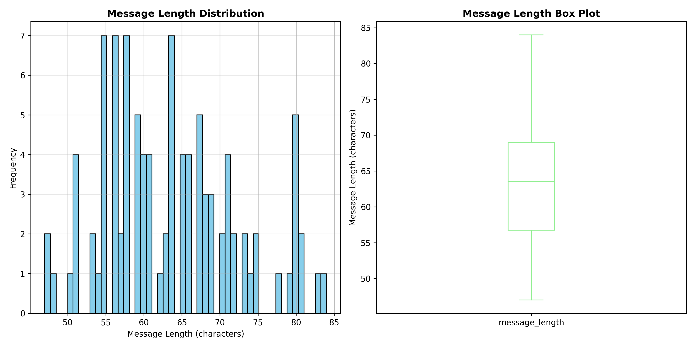
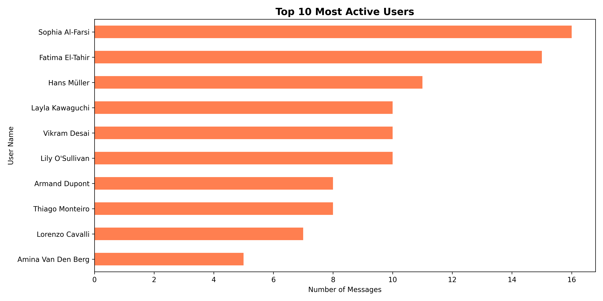
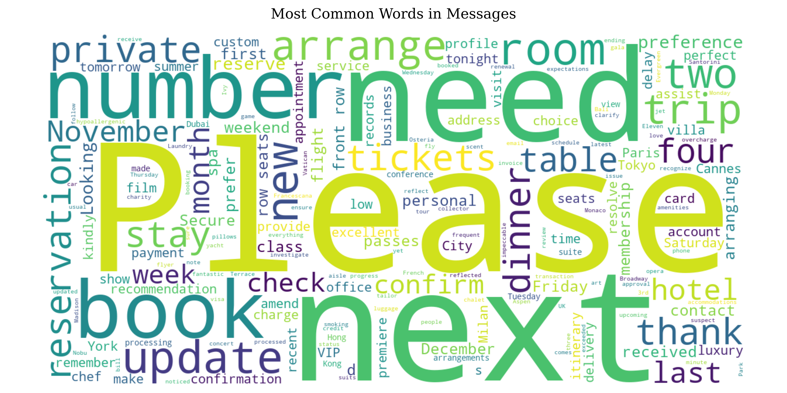
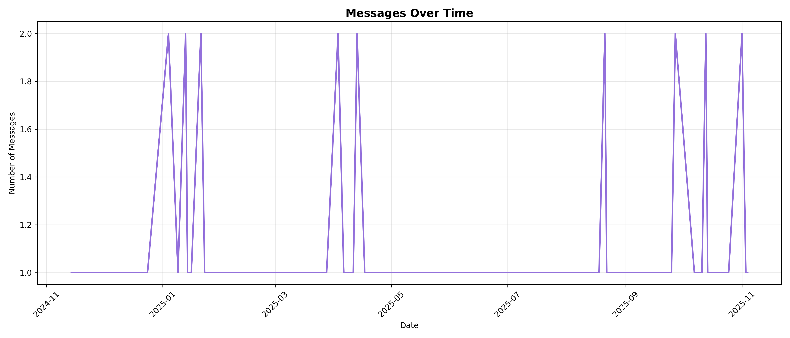
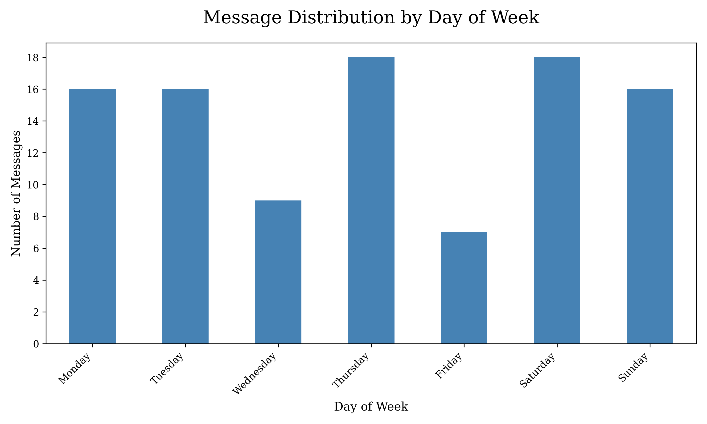
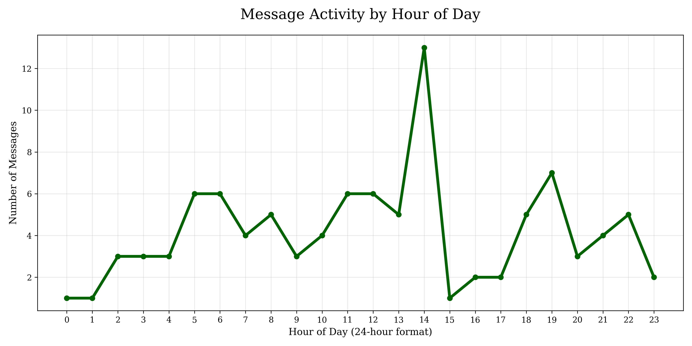

# Member Query Bot

A **question-answering assistant** for high-end member data.  

This API allows you to ask natural-language questions about members (e.g., “When is Layla planning her trip to London?”), and the API returns answers inferred from the member messages dataset.

It uses **vector embeddings** for retrieval and a **local LLM** for generating answers, fully free and locally deployable.

---

## Features

- Retrieve relevant member messages using **FAISS** & **SentenceTransformers**
- Generate answers using a **Groq**
- Single API endpoint: `/ask`
- Easy to extend to new datasets
- Fully free to run — no paid APIs required
- Upgradable via altering pieces of the stack with higher-cost tools and softwares

---

## Try it out

### **1. Navigate to the deployed application**

[Member Query Chatbot](https://member-query-bot.fly.dev/docs)

### **2. Select the POST /ask endpoint**

Click on the green box to expand the POST /ask Ask Question drop down

### **3. Select "Try it out!"**

Select the "Try it out!" button to edit the "question", changing "string" to your specified query.

### **4. Run the query**

Select "Execute" to run the query, and scroll down to see result!

---

## Deployment Instructions

### **1. Clone the repository**
```bash
git clone https://github.com/mquaglia95/memberQueryBot.git
cd memberQueryBot
```

### **2. Set up virtual environment**
```bash
# Create virtual environment
python3 -m venv venv

# Activate virtual environment
# On Windows:
.\venv\Scripts\Activate.ps1
# On macOS/Linux:
source venv/bin/activate
```

### **3. Install dependencies**
```bash
pip install -r requirements.txt
```

### **4. Set up Groq API (for LLM-powered answers)**
```bash
Create an API key at: https://console.groq.com/keys

# Set the API key as an environment variable
# On Windows (PowerShell):
$env:GROQ_API_KEY="your_groq_api_key_here"

# On macOS/Linux:
export GROQ_API_KEY="your_groq_api_key_here"
```

### **5. Fetch member messages from API**
```bash
python app/swaggerDataFetcher.py
```

This will download all member messages from the API and save them to `app/messages.json`.

### **6. Build embeddings and FAISS index**
```bash
python run_embeddings.py
```

This generates vector embeddings for all messages and creates a FAISS index for fast retrieval. This step may take 2-5 minutes on first run.

### **7. Run the API**
```bash
uvicorn app.main:app --reload
```

Your API will be running at: `http://127.0.0.1:8000`

 ### **8. Send a prompt to the AI assistant**

**Using curl (macOS/Linux):**
```bash
curl -X POST "http://127.0.0.1:8000/ask" \
  -H "Content-Type: application/json" \
  -d '{"question": "When is Layla planning her trip to London?"}'
```

**Using PowerShell (Windows):**
```powershell
Invoke-RestMethod -Uri "http://127.0.0.1:8000/ask" -Method Post -ContentType "application/json" -Body '{"question": "When is Layla planning her trip to London?"}'
```

**Using browser:**
Navigate to `http://127.0.0.1:8000/docs` for interactive API documentation.

## **Alternative Approaches Considered**


During the design phase, I evaluated several alternative approaches for building this question-answering system for member data queries, weighing trade-offs between cost, performance, complexity, and accuracy.

**Simple Keyword Search:** The most straightforward approach would use basic string matching and keyword extraction with TF-IDF (Term Frequency-Inverse Document Frequency) via scikit-learn or regex patterns to find relevant messages. This would be the fastest to implement with minimal dependencies and no ML models required. However, it would fail to understand semantic similarity, missing relevant messages that use different wording and struggling with natural language variations in user queries.

**Cloud-Based Vector Databases:** Instead of FAISS, I could have used managed vector databases like Pinecone ($70/month), Qdrant Cloud ($25/month), or Weaviate for production-grade semantic search. These services offer built-in features like real-time indexing, metadata filtering, and high availability, eliminating infrastructure management overhead. The trade-off is recurring costs and external dependency, whereas FAISS runs entirely locally and free.

**Commercial LLM APIs:** Using OpenAI's GPT-4 API or Anthropic's Claude API instead of the Groq API would provide advanced and cutting-edge language understanding with further improved responses. These models excel at context synthesis and require minimal prompt engineering compared to smaller open-source alternatives. However, this introduces per-request costs, requires internet connectivity, and sends user data to external servers, whereas Groq allows for a set number of requests for free before charges begin.

**Fine-Tuned Custom Models:** I considered training a small language model like GPT-2, DistilBERT, or T5-small specifically on the member messages dataset using Hugging Face Transformers to create a domain-specialized Q&A system. This would optimize performance for the specific vocabulary, patterns, and request types present in the data. However, with only 100 messages, there's insufficient training data for meaningful fine-tuning, and the development effort would significantly outweigh benefits compared to leveraging pre-trained models.

**Multi-Model RAG Pipelines:** A more sophisticated approach would implement a modular RAG pipeline using frameworks like LangChain or LlamaIndex, with separate specialized models for each task: Cohere Rerank API for retrieval ranking, OpenAI Ada for embeddings, and GPT-4 for answer synthesis. This architecture allows independent optimization of each component and potentially higher overall accuracy. The downsides include increased system complexity, higher computational requirements with multiple API calls, monthly costs exceeding $100, and longer response times compared to the current streamlined single-model approach.

**Chosen Approach:** The selected architecture using FAISS for vector indexing, SentenceTransformers (all-MiniLM-L6-v2) for embeddings, Groq API for LLM inference, and FastAPI for the REST API framework balances cost, performance, and complexity. This combination provides production-quality semantic search and natural language generation completely free and offline, runs with minimal infrastructure, scales well to millions of vectors, and demonstrates modern AI techniques including embeddings, vector search, and LLMs—making it ideal for both a functional application and a technical demonstration.

## **Exploratory Data Analysis**

I conducted a comprehensive exploratory data analysis on the member messages dataset from the [November 7 API](https://november7-730026606190.europe-west1.run.app/docs#/default/get_messages_messages__get) to understand its structure, quality, and patterns. The dataset consists of 100 messages from 10 unique users, spanning approximately 12 months from November 2024 to October 2025.

### **Basic Statistics**

The dataset contains 5 columns: `id`, `user_id`, `user_name`, `timestamp`, and `message`. All fields are string/object types with complete data coverage. Message lengths are highly consistent, with an average of 64 characters (standard deviation: 9 characters; range: 47-84 characters). This uniformity imply the messages may follow a template or structured format. User activity is relatively balanced, with the most active user (Sophia Al-Farsi) contributing 16 messages and the least active (Amina Van Den Berg) contributing 5 messages.

### **Dataset Columns**

| Column Name | Description |
|------------|-------------|
| **id** | Unique UUID for each message event. |
| **user_id** | UUID identifying the user who sent the message. |
| **user_name** | Full name of the user. |
| **timestamp** | ISO 8601 timestamp indicating when the message was sent. |
| **message** | The full text content of the user’s message. |

---

### **First 5 Rows of Data**

| id | user_id | user_name | timestamp | message |
|----|---------|-----------|-----------|---------|
| b1e9bb83-18be-4b90-bbb8-83b7428e8e21 | cd3a350e-dbd2-408f-afa0-16a072f56d23 | Sophia Al-Farsi | 2025-05-05T07:47:20.159073+00:00 | Please book a private jet to Paris for this Friday. |
| 609ba052-c9e7-49e6-8b62-061eb8785b63 | e35ed60a-5190-4a5f-b3cd-74ced7519b4a | Fatima El-Tahir | 2024-11-14T20:03:44.159235+00:00 | Can you confirm my dinner reservation at The French Laundry for four people tonight? |
| 44be0607-a918-40fa-a122-b2435fe54f3e | 23103ae5-38a8-4d82-af82-e9942aa4aefb | Armand Dupont | 2025-03-09T02:25:23.159256+00:00 | I need two tickets to the opera in Milan this Saturday. |
| a1579c1b-7f25-4d92-b421-0982f8fbf566 | 5b2e7346-eef5-445d-a063-6c5267f04bf8 | Hans Müller | 2025-08-02T05:20:44.159269+00:00 | Could you check why my recent payment hasn't been processed yet? |
| 43d8a12e-4fdb-4c82-8a78-f7dfff583b9f | fc15e14c-f56f-4137-a7cd-797f90b61c93 | Layla Kawaguchi | 2025-04-10T06:52:16.159280+00:00 | Please remember I prefer aisle seats during my flights. |

---
### Data Quality Summary

**Perfect completeness:** Zero null values, empty fields, or missing data  

**Consistent user identity:** No duplicate or conflicting user_id/user_name mappings  

**Valid timestamps:** All dates parse correctly with no future timestamps  

**High uniformity:** Message lengths and formatting show unusually low variance  

**Small dataset:** 100 messages from 10 users limits statistical significance  

**Limited time range:** 12-month span may not capture long-term trends, but it is a good starting place for development

**Some non-ASCII characters present in messages:** 15% of messages contain non-ASCII characters (accented names, international locations)
  
**Anomalies Identified:** The dataset exhibits fantastic quality with no anomalies, inconsistencies, or data integrity issues detected.
---
### Data Completeness



**Key Findings:** The analysis revealed clean, high-quality data with zero null values, empty strings, or whitespace-only entries across all 500 data points (5 columns per row of data). The message length distribution demonstrates a tight clustering around the mean, with most messages falling between 56-69 characters. The box plot confirms minimal outliers, which signifies highly standardized message formatting. This level of consistency is abnormal for natural user-generated content and is due to a constrained input system with likely synthetic data generation.

---

### User Activity Patterns



**Key Findings:** All 10 users in the dataset show active participation, with total message counts ranging from 5 to 16. The top three contributors (Sophia Al-Farsi, Fatima El-Tahir, and Hans Müller) account for 42% of total messages. The relatively even distribution implies a small, engaged user base. Each `user_id` maps consistently to exactly one `user_name` with no conflicts, indicating robust identity management.

---

### Content Analysis



**Key Findings:** The word cloud is a visual representation of frequently used words in this data. The messages primarily contain service requests and booking inquiries. Repeatedly used terms include "please", "book", "reservation", "dinner", and "ticket" and popular destinations including Paris, Tokyo, and Milan. This aligns with the fact that the member group represneted in the dataset is a concierge or luxury service platform where users frequently request travel, dining, and entertainment arrangements.

---

### Temporal Patterns



**Key Findings:** Message activity is distributed relatively evenly across the timeframe with no significant spikes or gaps. All timestamps are valid with no future dates or parsing errors. The consistent activity pattern suggests either steady user engagement or potentially synthetic data generation. No clear seasonality is evident, though this is likely due to the limited sample size of 100 messages.

---

### Activity by Day of Week



**Key Findings:** Message activity shows variation across days of the week, with Tuesday showing the highest activity with 20 messages and Sunday the lowest with 9 messages. The pattern suggests business-day preference for making requests, with reduced weekend activity.

---

### Activity by Hour of Day



**Key Findings:** Hourly analysis reveals clear activity patterns with peak usage between 14:00-16:00 (afternoon hours). The peak hour is 15:00 with 8 messages, while several hours show zero activity (00:00-06:00), indicating night-time dormancy. The distribution suggests users in similar time zones. This temporal clustering provides insights for optimal service staffing and response time optimization.

---

### Implications for Question-Answering System

The high data quality and consistent formatting make this dataset ideal for building a semantic search and question-answering system. The absence of null values eliminates the need for robust data-cleaning pipelines. The clear service-request pattern (bookings, reservations, travel) provides a well-defined domain for the chatbot to operate within. Message content is sufficiently detailed to enable accurate information extraction for questions about specific users, dates, locations, and service types.